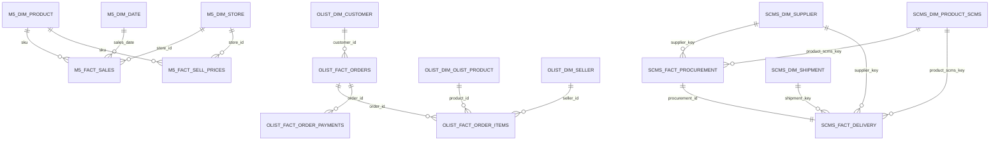

# Module 1 entity relationship diagram

```mermaid
erDiagram
  M5_DIM_PRODUCT ||--o{ M5_FACT_SALES : sku
  M5_DIM_STORE ||--o{ M5_FACT_SALES : store_id
  M5_DIM_DATE ||--o{ M5_FACT_SALES : sales_date
  M5_DIM_PRODUCT ||--o{ M5_FACT_SELL_PRICES : sku
  M5_DIM_STORE ||--o{ M5_FACT_SELL_PRICES : store_id

  OLIST_DIM_CUSTOMER ||--o{ OLIST_FACT_ORDERS : customer_id
  OLIST_FACT_ORDERS ||--o{ OLIST_FACT_ORDER_ITEMS : order_id
  OLIST_DIM_OLIST_PRODUCT ||--o{ OLIST_FACT_ORDER_ITEMS : product_id
  OLIST_DIM_SELLER ||--o{ OLIST_FACT_ORDER_ITEMS : seller_id
  OLIST_FACT_ORDERS ||--o{ OLIST_FACT_ORDER_PAYMENTS : order_id

  SCMS_DIM_SUPPLIER ||--o{ SCMS_FACT_PROCUREMENT : supplier_key
  SCMS_DIM_PRODUCT_SCMS ||--o{ SCMS_FACT_PROCUREMENT : product_scms_key
  SCMS_DIM_SHIPMENT ||--o{ SCMS_FACT_DELIVERY : shipment_key
  SCMS_DIM_SUPPLIER ||--o{ SCMS_FACT_DELIVERY : supplier_key
  SCMS_DIM_PRODUCT_SCMS ||--o{ SCMS_FACT_DELIVERY : product_scms_key
  SCMS_FACT_PROCUREMENT ||--|| SCMS_FACT_DELIVERY : procurement_id
```

The M5, Olist and SCMS subject areas are intentionally disconnected. No cross-source product or entity equivalence is inferred.
